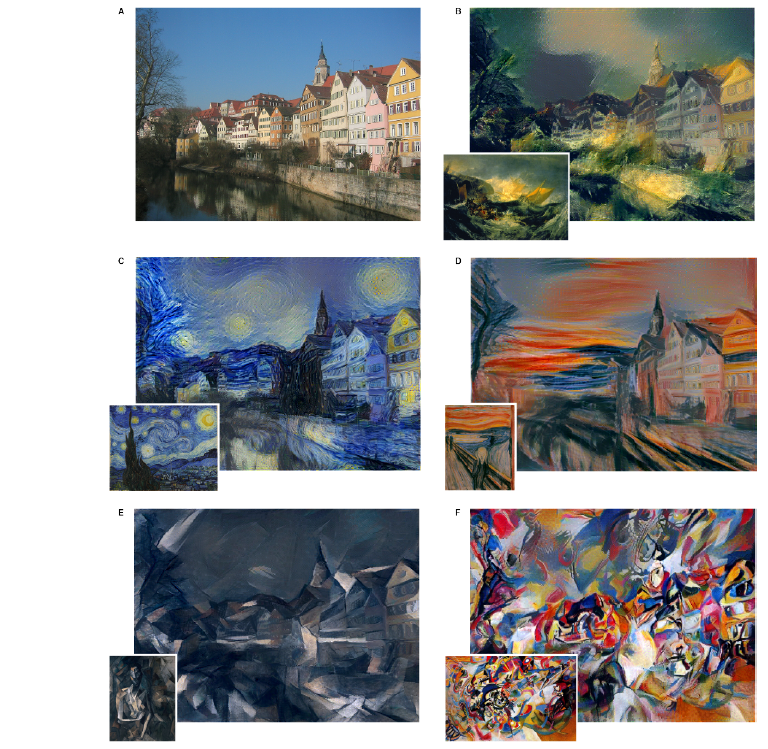

# Neural Style Transfer

Neural Style Transfer (Sinirsel Tarz Akarımı), verilen bir content resmi ile style resminden yeni bir resim üretebilen bir algoritmadır. Bu depoda bu yöntemi kullanarak ürettiğim resimleri paylaşacağım.

## Stil Nasıl Aktarılıyor?

* Ön eğitimli bir model özellik ayrıştırıcı olarak kullanılır.
* Content cost function için gizli katmanlardan bir tanesinin aktivayonları kullanılır.
* Bir gizli katmana air style cost function (loss, L) için o katmanın aktivasyonları kullanılarak gram matrisi oluşturulur. Bu matris farklı kanallar arasındaki korelasyon matrisidir ve genel bir style cost function (J) için birden çok gizli katman kullanılır. Gram matrisinde yüksek korelasyona sahip özellikler için, bir arada bulunma olasılıkları yüksek denebilir Örnek olarak; style resminde kenarlar kırmızı renk çoğunluğundaysa üretilen resimde kenar dedektörleri ile elde edilen kenarlarda kırmızı renk olma olasılığı fazla olur.
* Optimizasyon algoritmaları kullanılarak üretilen resime ait cost function çıkışı minimize edilir.

### Cost Function

Üretilen resim için cost function content ve style cost functionlarının toplamıdır.

J(G) = α * Jcontent(C,G) + β * Jstyle(S,G)

### Referans

[A Neural Algorithm of Artistic Style](https://arxiv.org/pdf/1508.06576.pdf)
